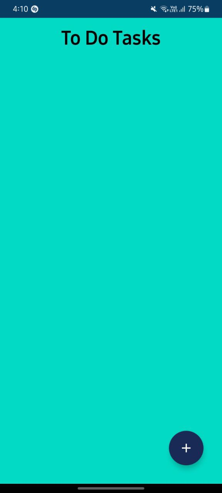
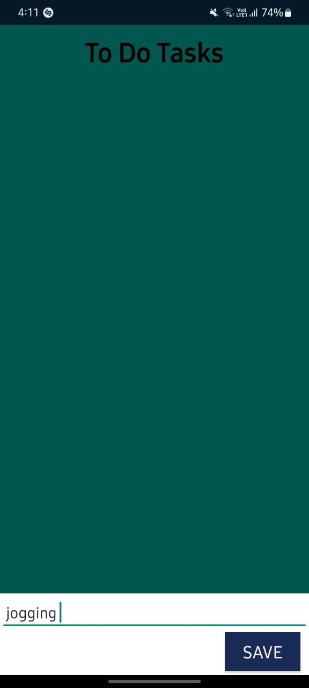
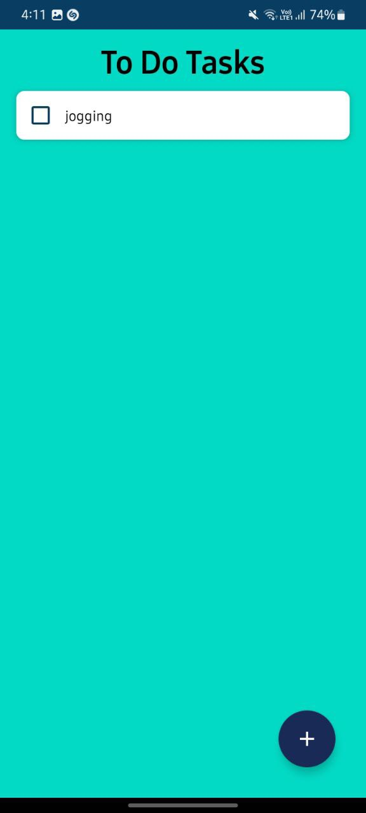
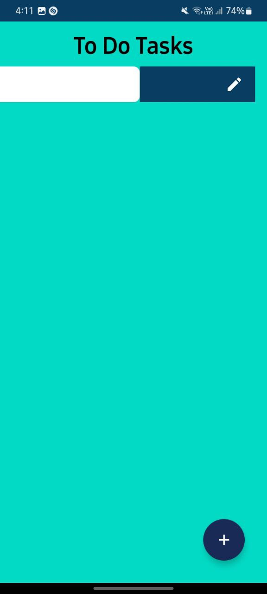
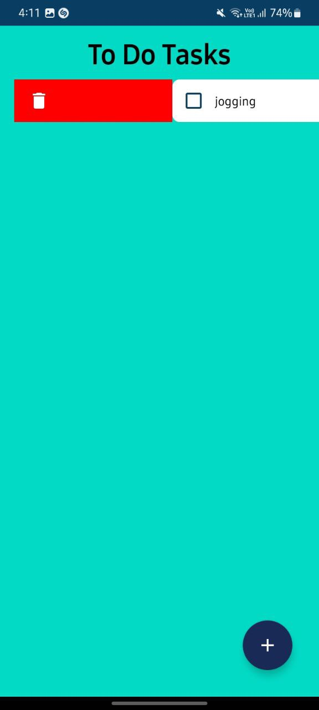
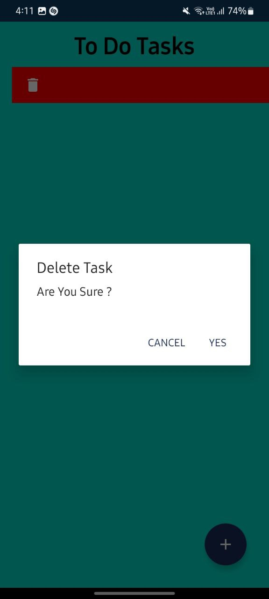
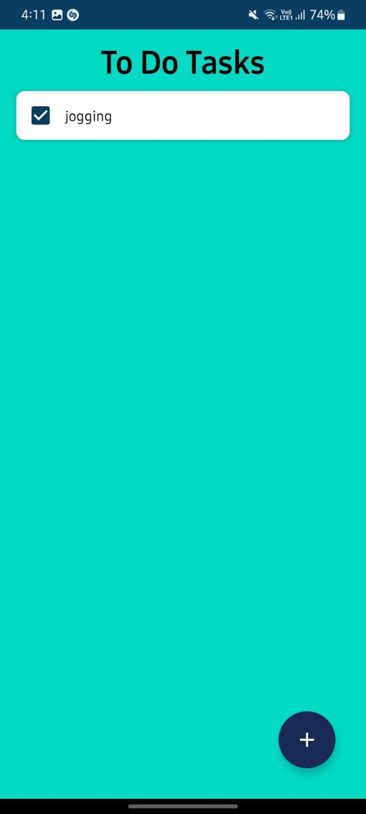

# To-Do List Android Application

## Technologies : Core JAVA, Kotlin , SQLite(Database) , XML(as UI)

### Description :

The project is a To-Do List application developed using Java and Kotlin, with SQLite as the underlying database. This application allows users to manage their tasks efficiently through a user-friendly interface. Users can view, add, edit, and delete tasks, as well as mark tasks as completed.

The application follows a structured architecture with distinct layers, including the user interface, data model, database layer, and business logic. The data model is represented by a Task class, encompassing properties such as id, title, description, due date, and completion status. The SQLite database, managed through a TaskTable, stores and retrieves task information.

The business logic is encapsulated in a TaskManager, facilitating communication between the user interface and the data model. It manages task retrieval, user actions (add, edit, delete), and updates to the database. Event listeners handle user input, triggering actions in the business logic layer.

### To-Do List App Abstraction :
1. User Interface (UI):
Main Screen:
Displays a list of tasks.
Allows users to view, add, edit, and delete tasks.
Supports marking tasks as completed.
Task Details Screen:
Displays detailed information about a specific task.
Allows users to edit task details.

### Process to access the project :

##### Before running the application, ensure that you have the following installed:

Android Studio - The official IDE for Android development.
Java Development Kit (JDK) - Make sure you have a compatible JDK installed.
    https://download.oracle.com/java/21/archive/jdk-21.0.1_windows-x64_bin.exe

##### Steps to Set Up and Run the Application

    Clone the Repository:

    bash
    Copy code
    git clone https://github.com/vamsi2000030493/ToDoList_KEKA_TECH.git
    cd todo-app

    Open Project in Android Studio:
        Launch Android Studio hedgehog.
        Click on "Open an existing Android Studio project."
        Navigate to the directory where you cloned the repository and select the project.

    Configure SDK and Emulator:
        Ensure that your SDK , API & Gradle is properly configured.
        Set up an emulator or connect a physical Android device.

    Build and Run:
        Build the project by clicking on the "Build" option in the top menu.
        Run the application by clicking on the "Run" option.

    Use the Application:
        Once the application is launched, you can start adding tasks, setting due dates, assigning priorities, and categorizing tasks.

    Local Storage:
        The application automatically utilizes local storage to save tasks. There's no need for additional setup for this feature.

    Explore Features:
        Test out different features such as changing task statuses (New, In Progress, Completed), updating task details, and deleting tasks.

    Task Management:
        Use the app to manage your tasks efficiently with the provided features.

### output :

### Author : Kona Vamsi Krishna | 2000030493cse@gmail.com
